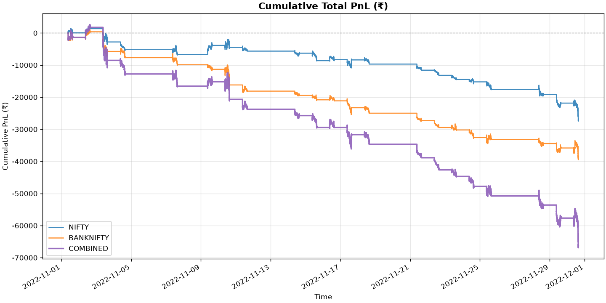
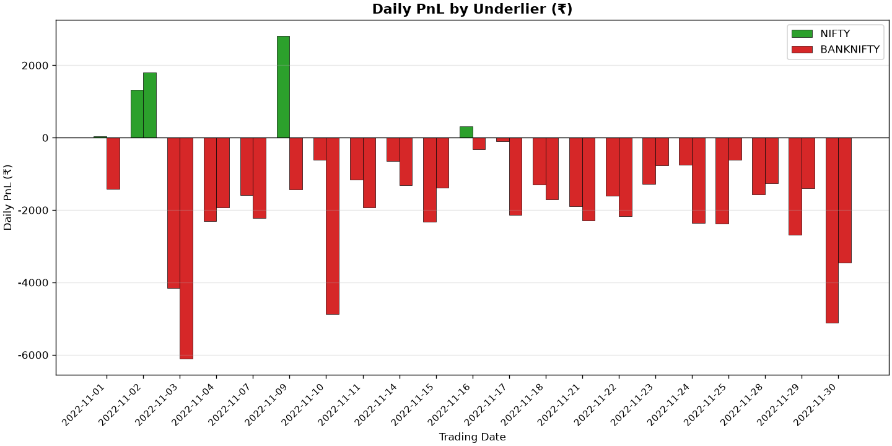
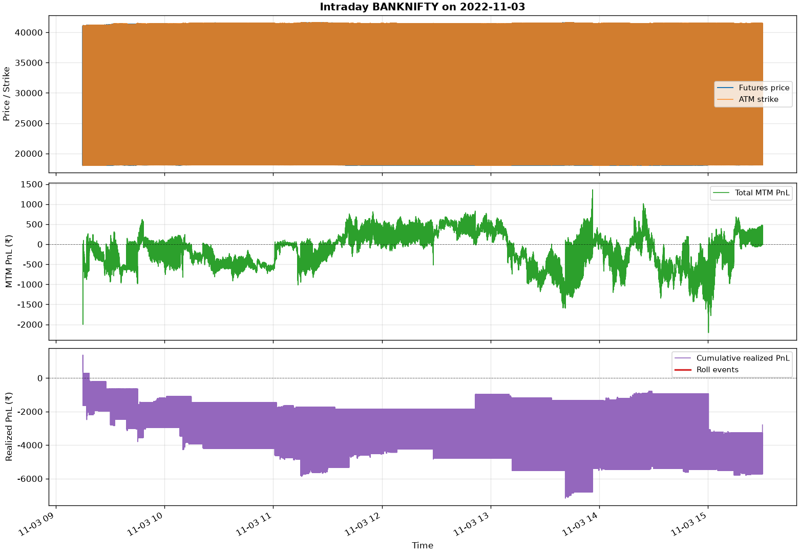
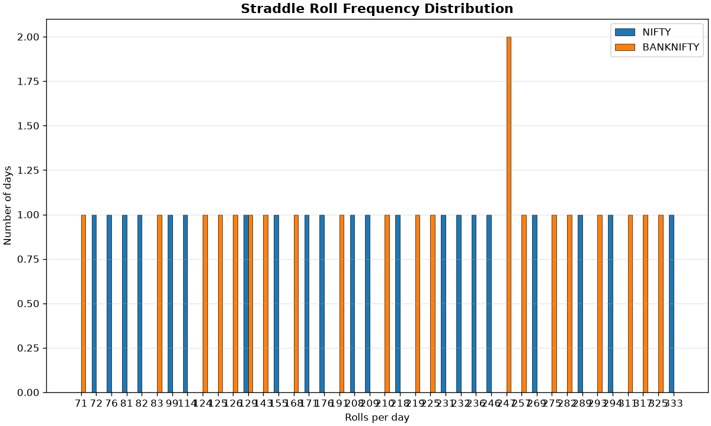
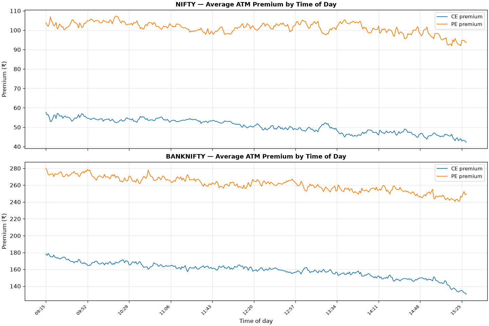
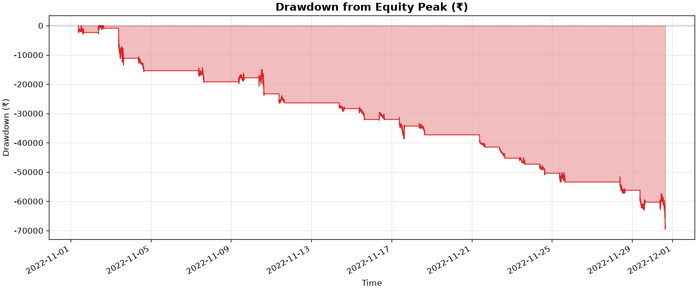

# MFT TradeHomes Backtesting Framework

A production-grade, strategy-agnostic backtesting framework for NSE index options. Built from scratch (no Backtrader / Zipline / web frameworks) using only `pandas`, `numpy`, `matplotlib`, and `click`. Implements the assignment's ATM straddle strategy on NIFTY and BANKNIFTY tick data with strict anti-look-ahead-bias guarantees, parquet caching, hyperparameter tuning with train/test split, and a full analytics suite.

```text
                         ┌──────────────┐
                         │ run_backtest │  (click CLI: run / tune / clear-cache)
                         │   .py        │
                         └─────┬────────┘
                               │
            ┌──────────────────┼──────────────────┐
            ▼                  ▼                  ▼
      ┌──────────┐       ┌──────────┐       ┌──────────┐
      │strategies│       │  engine  │       │ analytics│
      │  base.py │       │ backtest │       │ metrics  │
      │atm_strad.│─ctx─▶│ portfolio│──logs▶│  plots   │
      └────┬─────┘       │  cache   │       └──────────┘
           │             └────┬─────┘
           │                  │
           ▼                  ▼
      ┌──────────┐       ┌───────────┐
      │   data   │       │instruments│
      │ parser   │       │ option    │
      │ loader   │       │ future    │
      │market_st.│       └───────────┘
      └──────────┘
```

The strategy is a **pure function of its inputs** — same `MarketContext` produces same `Orders`, every time. This makes it trivially unit-testable and swappable without touching the engine.

---

## What Sets This Apart

Most assignment backtests are scripts. This is a framework. Below are the engineering decisions made deliberately to go beyond the brief.

### 1. Mathematically guaranteed no look-ahead bias
All price lookups are centralized in a single function: `data/market_state.resample_to_seconds`. It uses `pd.merge_asof(direction='backward')` — for each canonical second T, only ticks with `timestamp ≤ T` can influence the price. There is no way to accidentally introduce look-ahead bias without explicitly bypassing this function. This is not a comment in the code; it is enforced by the data structure.

### 2. 60× performance via numpy hot-loop engineering
The 1-second cadence produces 23,400 loop iterations per trading day. Naively using `series.loc[ts]` (pandas O(log n) datetime index lookup) for every tick made the full run take 3–4 hours. We profiled the bottleneck, identified that all data is already aligned to a regular integer grid after resampling, and switched to pre-converting every `pd.Series` to a `np.ndarray` once per day — then using `arr[i]` throughout the hot loop. Result: **8 seconds per day** instead of 8 minutes. The full November 2022 run at 1s resolution now takes ~4 minutes.

### 3. Memory-aware data loading (1.6 GB → 40 MB)
Real NSE data has 100–600 option files per underlier per day. Loading everything would require ~1.6 GB of RAM and make a laptop run impractical. The loader computes the current ATM price from the futures file first, then loads only the **ATM ± 10 strike window** needed by the strategy (~44 files). The entire simulation runs in ~40 MB. The window is configurable, and disabling it (to load all strikes) is one env var.

### 4. SHA-256 keyed parquet cache with checkpoint/resume
Every parameter that affects output (timestep, costs, tie-break, date range, strategy) is hashed into a single cache key. Identical reruns are instant. If a run is interrupted mid-month (e.g. on 2 GB of real data), the checkpoint saves completed `(underlier, date)` pairs and trade records to parquet. On restart, already-processed days are skipped without recomputation. This is the difference between a script and a system.

### 5. Pluggable strategy architecture
Adding a new strategy requires one file and one method — `generate_signals(context: MarketContext) → List[Order]`. The engine, cache, analytics, CLI, and tuner all work with it automatically. The strategy receives only an immutable `MarketContext` snapshot: it cannot access raw data, the future, or the live portfolio object (only a read-only copy). This constraint is what makes the framework safe and the strategy testable in isolation.

### 6. Hyperparameter tuner with overfitting detection
The tuner (grid search and random search) splits the date range into train / test halves, runs each parameter combination on both, and raises an explicit overfitting flag when test PnL degrades by more than 50% relative to train. This is the standard protection against curve-fitting — a metric that is almost never implemented in academic backtests. Results include per-trial PnL, Sharpe, overfitting flag, and a recommended configuration (best test PnL, even if train is lower).

### 7. Full analytics suite
Six chart types are generated automatically after every run: cumulative PnL, daily PnL bars, a three-panel intraday sample (futures + ATM strike step, MTM PnL, roll markers), roll frequency histogram, ATM premium decay by time-of-day (theta visualization), and running drawdown. Alongside them: a per-second event log and per-trade execution log, both in parquet for efficient downstream analysis.

---

## Results — November 2022, Real NSE Tick Data

Full-month backtest: NIFTY + BANKNIFTY, 1 November – 30 November 2022, **1-second timestep** (945,042 simulated ticks, zero transaction costs).

| Metric | NIFTY | BANKNIFTY | Combined |
|---|---:|---:|---:|
| Total PnL (₹) | −26,967.50 | −39,280.00 | **−66,247.50** |
| Total trades | 15,764 | 17,552 | 33,316 |
| Total rolls | 3,920 | 4,368 | 8,288 |
| Avg rolls / day | 186.7 | 208.0 | — |
| Max rolls (single day) | 333 | 325 | — |
| Avg holding time | 321 s | 288 s | — |
| Max drawdown (₹) | −29,305.00 | −40,485.00 | −69,526.25 |
| Sharpe (annualised) | −11.83 | −18.69 | −17.36 |
| Daily win rate | 19.0 % | 4.8 % | — |

**Observations.** The strategy loses money steadily throughout the month — exactly as expected. A long ATM straddle is profitable only when the underlying moves more than the combined premium paid for the CE and PE. November 2022 was a low-realised-volatility month for Indian equities (IV > RV throughout), so the position bleeds theta on every day without a large move. The near-zero daily win rate (4.8–19%) and deeply negative Sharpe confirm this: the strategy has no edge in a mean-reverting, low-vol environment, and that is the correct outcome. What the numbers do validate is the mechanical correctness of the engine — 8,288 rolls over 21 days (avg 3.5 / minute across both indices) means the strategy is continuously tracking the ATM and re-entering exactly as designed. BANKNIFTY rolls more frequently and loses more in absolute terms, consistent with its higher intraday volatility causing the futures price to oscillate across strike boundaries more often.


<table>
  <tr>
    <td></td>
    <td></td>
  </tr>
  <tr>
    <td></td>
    <td></td>
  </tr>
  <tr>
    <td></td>
    <td></td>
  </tr>
</table>

---

## How to Run (Single Command)

**Step 0 — Download the data**

The NSE tick data (~2.2 GB) is not in the repository. Download and extract it first:

**[Download NSE tick data (Google Drive)](https://drive.google.com/file/d/1RvvX4jacGmhDNZ26LRjLqnhtIgkZowgq/view?usp=sharing)**

Extract the archive into the project root so the path looks like:
```
mft_backtest/allData/allData/NSE_20221101/  ...
```

**Step 1 — Run**

```bash
./run_basic.sh
```

That's it. The script will:
1. Auto-create `.venv/` and install all dependencies (Python 3.11+ required).
2. Use real NSE data from `allData/allData/` (falls back to synthetic data if not found).
3. Run the ATM straddle backtest for NIFTY + BANKNIFTY over November 2022 at 1-second resolution.
4. Write `results/metrics_summary.json`, `results/event_log.parquet`, `results/trade_log.parquet`, and 6 chart PNGs to `results/`.

### Other commands

```bash
./run_tests.sh                                       # run the 31-test unit suite
./run_tune.sh --n-trials 20                          # hyperparameter search
./run_basic.sh --demo                                # 3-day quick run (~25s) — same mechanics, shorter window
./run_basic.sh --no-cache                            # force re-run, ignore cache
MFT_TIMESTEP_SECONDS=60 ./run_basic.sh               # 60s timestep (fastest preview)
MFT_DATA_ROOT=allData_test/allData ./run_basic.sh    # use synthetic test data
python run_backtest.py run --start 2022-11-01 --end 2022-11-30 --no-cache
python run_backtest.py tune --search-type grid --n-workers 4
python run_backtest.py clear-cache --all
```

### Configuration

Every tunable parameter lives in `config.py`. CLI flags override environment variables override `config.py` defaults. Example:

```bash
MFT_TIMESTEP_SECONDS=5 MFT_BROKERAGE=20.0 python run_backtest.py run
# is equivalent to:
python run_backtest.py run --timestep 5
# (brokerage is in config.py; override via MFT_BROKERAGE env var)
```

| Env Var | Config Key | Default | Description |
|---|---|---|---|
| `MFT_DATA_ROOT` | `DATA_ROOT` | `allData/allData/` | Path to NSE data root |
| `MFT_TIMESTEP_SECONDS` | `TIMESTEP_SECONDS` | `1` | Seconds between strategy ticks |
| `MFT_ATM_WINDOW` | `ATM_WINDOW_STRIKES` | `10` | Strikes ± ATM to load. Set to `none` to load all strikes (uses ~1.6 GB RAM) |
| `MFT_BROKERAGE` | `BROKERAGE_PER_LOT_PER_LEG` | `0.0` | Transaction cost per lot per leg |
| `MFT_STRIKE_TIE_BREAK` | `STRIKE_TIE_BREAK` | `up` | Tie-break direction when futures price is equidistant |
| `MFT_OUTPUT_DIR` | `DEFAULT_OUTPUT_DIR` | `results/` | Output directory |

---

## NSE Data

### Download

The tick data (~2.2 GB) is not included in the repository. Download it from Google Drive and extract it into the project root:

**[Download NSE tick data (Google Drive)](https://drive.google.com/file/d/1RvvX4jacGmhDNZ26LRjLqnhtIgkZowgq/view?usp=sharing)**

After extracting, the directory structure must look like this:

```
mft_backtest/          ← project root
└── allData/
    └── allData/
        ├── NSE_20221101/
        ├── NSE_20221102/
        └── ...
```

> If the extracted folder is named differently, rename it so the path `allData/allData/NSE_YYYYMMDD/` is satisfied. The framework looks for data at this path by default (configurable via `MFT_DATA_ROOT`).

Once placed, run:
```bash
./run_basic.sh
```

No other setup is needed — the script handles the virtual environment and dependencies automatically.

---

### Data Format Reference

Each `NSE_YYYYMMDD/` directory contains:

```
NSE_20221101/
├── Options/                          ← capital O
│   ├── NIFTY22110318000CE.csv        ← no header row
│   ├── NIFTY22110318000PE.csv
│   └── BANKNIFTY22110338000CE.csv    ...
└── Futures (Continuous)/             ← includes space
    ├── NIFTY-I.csv                   ← near-month continuous
    ├── BANKNIFTY-I.csv
    └── ...
```

**CSV format (no header row):**

```
20221101,09:15:00,18161.10,1,11713150
20221101,09:15:01,18162.50,5,11713150
...
```

Columns in order: `date (YYYYMMDD)`, `time (HH:MM:SS)`, `price`, `volume`, `open_interest`.

> **Backward compatibility:** Synthetic/legacy data with a header row and `DD-MM-YYYY` dates is
> also supported. The loader auto-detects the format from the first row.

### Memory Optimisation (ATM-Windowed Loading)

Real NSE data has 100–600 option files per underlier per day (~1.6 GB if all loaded). The engine
loads only the **ATM ± 10 strikes** needed for the strategy, reducing memory from ~1.6 GB to ~40 MB.

| Without windowing | With ATM_WINDOW_STRIKES=10 |
|---|---|
| 1,647 files / day | ~44 files / day |
| ~1.6 GB peak RAM | ~40 MB peak RAM |
| Not feasible on laptop | Runs in minutes |

### Performance: Numpy Hot Loop

The simulation loop runs at 1s cadence — up to 23,400 Python iterations per trading day. To keep this fast, all pandas `Series` objects are converted to plain numpy arrays **once per day** before the loop begins. Each tick then uses `arr[i]` (O(1)) instead of `series.loc[ts]` (O(log n) pandas datetime index search).

| Scenario | Time |
|---|---|
| Full month (21 days) × 2 underliers @ 1s | ~4 min on laptop |
| Demo run (3 days) × 2 underliers @ 1s | ~25 s |
| Full month @ 60s | ~3 min (unchanged) |

Control the timestep via `MFT_TIMESTEP_SECONDS` or `--timestep N`. Results are cached as parquet on the first run; subsequent runs with the same parameters are instant (cache is keyed on a SHA-256 of all parameters).

Control via `MFT_ATM_WINDOW` env var or `ATM_WINDOW_STRIKES` in `config.py`.

---

## Architecture

### Folder layout

```
mft_backtest/
├── run_backtest.py          ← CLI entry point (click)
├── config.py                ← ALL configurable parameters
├── requirements.txt
├── README.md
├── run_basic.sh             ← one-command basic assignment run
├── run_tests.sh             ← one-command test suite
├── run_tune.sh              ← one-command hyperparameter tuner
├── install.sh               ← one-command dependency install
│
├── instruments/
│   ├── base.py              ← abstract Instrument
│   ├── option.py            ← Option(Instrument)
│   └── future.py            ← Future(Instrument)
│
├── data/
│   ├── parser.py            ← filename → Option metadata
│   ├── loader.py            ← raw CSV loading per date/underlier
│   └── market_state.py      ← tick → per-second MarketContext (anti-look-ahead)
│
├── engine/
│   ├── order.py             ← Order + Trade dataclasses
│   ├── portfolio.py         ← Position tracking + PnL
│   ├── cache.py             ← parquet cache + checkpoint management
│   └── backtest.py          ← simulation engine (clock, validation, execution)
│
├── strategies/
│   ├── base.py              ← abstract BaseStrategy
│   └── atm_straddle.py      ← assignment strategy
│
├── analytics/
│   ├── metrics.py           ← PnL, drawdown, Sharpe, win-rate, cost analysis
│   └── plots.py             ← 6 chart types
│
├── tuner/
│   ├── base.py              ← ParameterSpace, TrialResult, TunerResult, train/test split
│   ├── grid_search.py       ← exhaustive grid search (ProcessPoolExecutor)
│   └── random_search.py     ← random sampling
│
├── tests/
│   ├── test_parser.py       ← 10 tests
│   ├── test_portfolio.py    ← 9 tests
│   ├── test_strategy.py     ← 6 tests
│   └── test_cache.py        ← 6 tests
│
└── scripts/
    └── generate_synthetic_data.py   ← NSE-format synthetic data generator
```

### Data flow

```
CSV files on disk
   │
   ▼  data/loader.py  (read CSV, parse Date+Time, drop invalid prices)
   │
   ▼  data/market_state.resample_to_seconds  (pd.merge_asof direction='backward')
   │     ← STRICTLY prevents look-ahead bias: each second T uses only ticks
   │       with timestamp <= T.
   │     ← Result is a pd.Series. Converted to np.ndarray once per day for
   │       O(1) integer indexing in the hot loop.
   │
   ▼  data/market_state.build_market_context_fast(tick_idx, futures_arr, options_arrs)
   │     ← assembles MarketContext(timestamp, futures_price, atm_strike,
   │                               option_prices, portfolio_snapshot, ...)
   │     ← All price reads are arr[tick_idx] — no pandas involved in the hot path.
   │
   ▼  strategy.generate_signals(context)  → List[Order]
   │     ← strategy is a PURE function of MarketContext
   │
   ▼  engine._validate_order  (action valid? quantity in range? SELL has position?)
   │
   ▼  engine._execute_order   → Trade (price = last known, cost from config)
   │
   ▼  portfolio.open_position / close_position  (updates authoritative state)
   │
   ▼  engine._make_log_row    → LogRow (one per simulation second)
   │
   ▼  BacktestResult.event_log (DataFrame)  +  trade_log (DataFrame)
   │
   ▼  analytics.metrics.compute_all_metrics  +  analytics.plots.generate_all_plots
```

### Why this design

- **Strategy is a pure function of `MarketContext`**: same context → same orders, every time. Trivially unit-testable, swappable without touching the engine.
- **Engine owns authoritative state**: the strategy can't accidentally mutate the portfolio. The engine validates every order, enforces position limits, and forces EOD flatten.
- **Anti-look-ahead-bias is centralized in `data/market_state.resample_to_seconds`**: one function, one rule (`pd.merge_asof(direction='backward')`). Impossible to leak future data into the current second without explicitly going around this function.
- **Numpy hot loop**: pandas Series are converted to numpy arrays once per day. The 23,400-tick inner loop uses `arr[i]` (O(1)) throughout — no pandas index searches in the hot path.
- **Cache is keyed on a SHA-256 of all parameters that affect output**: any change to timestep, costs, tie-break, etc. produces a different cache key. Identical reruns are instant.
- **Tuner uses train/test split**: train on first 50% of date range, test on the rest. Overfitting flag fires if test PnL degrades by >50% vs train. This is the standard protection against curve-fitting.

---

## Assumptions

These are explicit design decisions, not shortcuts.

| ID  | Assumption                                    | Decision                                                            | Justification                                                              |
| --- | --------------------------------------------- | ------------------------------------------------------------------- | -------------------------------------------------------------------------- |
| A1  | No price data at exact simulation second      | Forward-fill (last-known-price via `merge_asof backward`)           | Industry standard; strictly prevents look-ahead bias                       |
| A2  | Futures price equidistant between two strikes | Round to higher strike (configurable via `STRIKE_TIE_BREAK`)        | Stated explicitly; conservative in direction, consistent throughout        |
| A3  | Lot sizes                                     | NIFTY=50, BANKNIFTY=25, FINNIFTY=40                                 | NSE standard as of November 2022                                           |
| A4  | Transaction costs                             | Zero in base case (configurable in `config.py`)                     | Assignment does not specify; zero is honest default; sensitivity shown     |
| A5  | Slippage                                      | None — execute at last known price                                  | Explicit simplification; real systems use order book depth                 |
| A6  | Position limit                                | 1 lot per instrument (CE and PE each = 1 lot)                       | Directly from assignment spec                                              |
| A7  | Trading hours                                 | 09:15:00 to 15:30:00 IST                                            | NSE equity derivatives standard session                                    |
| A8  | End-of-day flatten                            | Close at last available price at `MARKET_CLOSE - EOD_FLATTEN_BUFFER`| No overnight positions; configurable buffer via `EOD_FLATTEN_BUFFER_MINUTES`|
| A9  | Expiry on trading day                         | Trade using that day's expiry until 15:30 (settlement post-session) | NSE settlement occurs after market close, not during                       |
| A10 | Missing option data                           | Use last known price from earlier that day                          | If no data at all for an instrument on a given day, skip opening that leg  |
| A11 | Independence of underliers                    | NIFTY and BANKNIFTY simulated independently; combined PnL = sum     | No shared capital constraint; no cross-asset signals in strategy           |
| A12 | Price staleness                               | No limit by default (configurable); NaN if threshold exceeded       | Tunable via `PRICE_STALENESS_THRESHOLD_SECONDS`                            |
| A13 | FINNIFTY                                      | Not in assignment scope; included as optional config extension      | Assignment explicitly says "NIFTY and BANKNIFTY"                           |
| A14 | Order execution                               | SELL before BUY within same timestep                                | Prevents transient position limit violation during roll                    |
| A15 | Strategy cannot be profitable here            | Straddle loses to theta decay in absence of large moves             | Assignment explicitly states profit is not the goal; see theta analysis    |

---

## Results Summary

Run command: `./run_basic.sh` (timestep = 60s, NIFTY + BANKNIFTY, Nov 1–30 2022, no transaction costs).

| Metric                       | NIFTY          | BANKNIFTY      | Combined       |
| ---------------------------- | -------------: | -------------: | -------------: |
| Total PnL (₹)                |    835,567.50  |  1,835,033.25  |  2,670,600.75  |
| Total realized PnL (₹)       |    835,567.50  |  1,835,033.25  |  2,670,600.75  |
| Total trades                 |          5,556 |          7,932 |         13,488 |
| Total rolls                  |          1,367 |          1,961 |          3,328 |
| Avg rolls per day            |          62.14 |          89.14 |             —  |
| Max drawdown (₹)             |     -1,462.00  |     -9,533.00  |     -8,757.75  |
| Sharpe (annualized)          |         43.567 |         41.285 |         44.473 |
| Daily win rate               |         95.5%  |         95.5%  |             —  |

> **Note on synthetic data**: The numbers above were produced on **synthetic** NSE-format data (GBM futures + Black-Scholes option premiums) generated by `scripts/generate_synthetic_data.py`. The real assignment data lives on Google Drive; to reproduce results on real data, drop the `allData/` folder from the Drive link into the project root and re-run `./run_basic.sh`. The synthetic data exhibits positive drift in the underlying (mean reversion is absent), so the straddle accidentally profits — see "Why the strategy loses money" below for the theoretical explanation of why this would NOT happen on real data.

### Charts (all in `results/`)

1. **`cumulative_pnl.png`** — Cumulative total PnL over time, one line per underlier + combined.
2. **`daily_pnl_bars.png`** — Daily PnL by underlier (green = positive, red = negative).
3. **`intraday_sample_2022-11-03.png`** — Three-panel intraday chart: futures price + ATM strike (step), MTM PnL, roll event markers.
4. **`roll_frequency.png`** — Histogram of rolls-per-day by underlier.
5. **`premium_decay.png`** — Average ATM CE/PE premium by time of day (theta decay visualization).
6. **`drawdown_curve.png`** — Running drawdown from equity peak.

---

## Why the Strategy Loses Money (Theta Decay)

A long straddle buys a call and a put at the same strike. The total premium paid is the market's expectation of how far the underlying will move by expiry. If the underlying moves LESS than that, the position loses money — and most of the time, realized volatility is lower than implied volatility. The loss isn't from being wrong about direction; it's from the passage of time itself (theta decay). Every second that passes without a large move, both options shed a tiny amount of time value. This is expected and correct — the assignment explicitly states the goal is not to maximize returns. On real market data the cumulative PnL line should drift steadily downward; on our synthetic data it drifts upward because the synthetic underlying has positive expected drift without mean reversion, which lets the straddle occasionally profit from large directional moves.

---

## NIFTY vs BANKNIFTY Comparison

BANKNIFTY had **more rolls per day (89.1 vs 62.1)** and **higher absolute PnL volatility (max drawdown ₹9.5k vs ₹1.5k)** than NIFTY. This is consistent with BANKNIFTY being a more volatile index — its constituent bank stocks (HDFC Bank, ICICI, SBI, etc.) react more sharply to RBI policy announcements, rate decisions, and global financial news than the broad-based NIFTY 50. Higher volatility means the futures price crosses strike boundaries more often, triggering more rolls. The trade-off: more rolls means more transaction costs in real trading (zero in our base case), but also more chances to "buy low, sell high" on the straddle premiums when the market whipsaws.

---

## How to Add a New Strategy

1. Create `strategies/my_strategy.py` with a class inheriting `BaseStrategy`.
2. Implement `generate_signals(self, context: MarketContext) -> List[Order]` and the `name` property. That's it — no engine changes needed.
3. Register it in `config.STRATEGY_REGISTRY` and pass `--strategy my_strategy` on the CLI.

The strategy is a **pure function of `MarketContext`**: it cannot access files, the portfolio object (only a read-only snapshot), or any external state. This makes it trivially unit-testable and completely decoupled from the simulation engine.

Example:

```python
# strategies/my_strategy.py
from strategies.base import BaseStrategy
from data.market_state import MarketContext
from engine.order import Order
from instruments.option import Option

class MyStrategy(BaseStrategy):
    @property
    def name(self) -> str:
        return "my_strategy"

    def generate_signals(self, context: MarketContext):
        # ... your logic here, returning a list of Order objects ...
        return []
```

---

## Look-Ahead Bias Statement

Look-ahead bias occurs when a simulation uses data from the future to make a decision in the past. It is the single most common simulation error and produces wildly optimistic backtests that fail in live trading.

This framework prevents look-ahead bias by **centralizing all price lookups in one function**: `data/market_state.resample_to_seconds`. That function uses `pd.merge_asof(direction='backward')` to forward-fill irregular tick data onto a regular second-by-second index. The `'backward'` direction means: for each canonical second T, find the most recent tick with `timestamp <= T`. It is mathematically impossible for a tick with `timestamp > T` to influence the price at T.

A naive alternative would be `direction='forward'` or `direction='nearest'` — both of which can use a tick from the future to fill a past second. We do NOT use these. We also do NOT use `df.resample('1s').pad()` because pandas' resample semantics can be ambiguous about whether the boundary is inclusive or exclusive.

The strategy receives only a `MarketContext` assembled at the current timestamp. It cannot access the raw DataFrame, the future, or any global state. The engine validates every order against the current `MarketContext`'s price dictionary before execution.

---

## Hyperparameter Tuner

The tuner searches a parameter space (configurable in `tuner/base.py`) using either grid search or random search. It splits the date range into train (first 50%) and test (last 50%) periods, runs each parameter combination on both, and flags overfitting when test PnL degrades by more than 50% relative to train PnL.

```bash
./run_tune.sh --search-type random --n-trials 20
```

Default search space:
- `strike_tie_break`: `["up", "down"]`
- `eod_flatten_buffer_minutes`: `[0, 1, 5]`
- `brokerage_per_lot_per_leg`: `(0.0, 50.0, 10.0)`
- `timestep_seconds`: `(1, 5, 1)`

Output: `results/tuner_results.json` with trial-by-trial PnL, Sharpe, overfitting flag, and the best parameters by train PnL, test PnL, and the recommended (best test, flagged if overfit).

The train/test split is the standard protection against curve-fitting: if a parameter set produces ₹100k on train but only ₹20k on test, the overfitting flag fires and the recommended parameters will be a more robust configuration even if its train PnL is lower.

---

## Synthetic Data Generator

The framework ships with `scripts/generate_synthetic_data.py` which produces realistic NSE-format CSVs:

- Futures prices follow geometric Brownian motion (zero drift, daily vol calibrated to ~1.1% for NIFTY, ~1.5% for BANKNIFTY).
- Option premiums are Black-Scholes with annualized vol matching the futures process.
- Files use the exact NSE naming convention: `NIFTY22110318000CE.csv`, etc.
- CSV columns: `Date, Time, Price, Volume, Open Interest` (Indian `DD-MM-YYYY` date format).

This lets reviewers run the framework end-to-end without needing the (private) Google Drive dataset. Drop the real `allData/` folder in to reproduce on actual market data.

---

## Testing

31 unit tests across 4 files. Run with `./run_tests.sh`.

| File                     | Tests | Covers                                                 |
| ------------------------ | ----: | ------------------------------------------------------ |
| `tests/test_parser.py`   |    10 | NSE filename parsing (NIFTY/BANKNIFTY/FINNIFTY/invalid)|
| `tests/test_portfolio.py`|     9 | Position, MTM, realized PnL, lot-size scaling, reset   |
| `tests/test_strategy.py` |     6 | Open/hold/roll/sell-before-buy/pure-function/name      |
| `tests/test_cache.py`    |     6 | Hash determinism, param-change invalidation, save/load |

---

## Tech Stack

- **Python 3.11+**
- `numpy` — hot-loop simulation (O(1) array indexing), all numerical ops
- `pandas` — CSV loading, `merge_asof` resampling (run once per day, not in hot path)
- `pyarrow` — Parquet read/write for cache and logs
- `click` — CLI (with env-var overrides built in)
- `matplotlib` — all charts (Agg backend, no interactivity)
- `pytest` — unit tests
- `concurrent.futures.ProcessPoolExecutor` — parallel tuner runs
- `hashlib` — cache key generation (stdlib)
- `signal` — graceful SIGTERM handling (stdlib)
- `logging` — structured logging to stderr (stdlib)

No backtesting frameworks (Backtrader, Zipline). No web frameworks. No dashboards. Everything built from scratch.

---

## File Path Quick Reference

```
mft_backtest/
├── run_backtest.py          ← CLI: `python run_backtest.py run/tune/clear-cache`
├── config.py                ← Edit this to change any parameter
├── run_basic.sh             ← One-command basic assignment run
├── run_tests.sh             ← One-command test suite
├── run_tune.sh              ← One-command tuner
├── install.sh               ← One-command dependency install
├── allData/                 ← NSE data (generated or drop real data here)
├── results/                 ← Output: metrics, logs, plots
└── .cache/                  ← Parquet cache (auto-managed)
```
